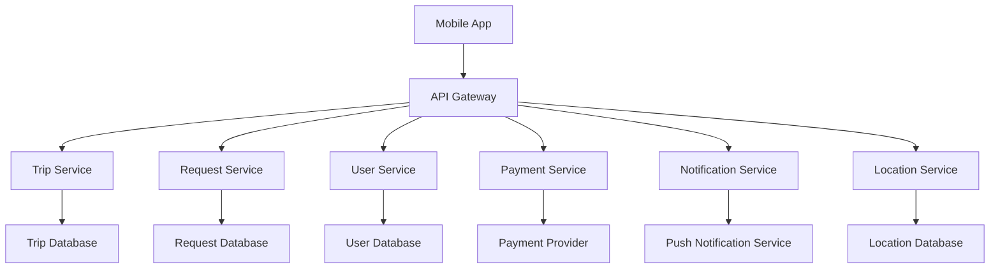

# Design Document

## Overview

The Community Delivery system is a location-based peer-to-peer delivery platform that connects users who are traveling to stores with community members who need items delivered. The system consists of a mobile application with real-time location services, trip management, request matching, in-app messaging, payment processing, and reputation management.

## Architecture

The system follows a client-server architecture with the following key components:



### Core Services

- **Trip Service**: Manages trip announcements, capacity tracking, and status updates
- **Request Service**: Handles delivery requests, matching, and fulfillment tracking
- **User Service**: Manages user profiles, authentication, and reputation system
- **Payment Service**: Processes payments, handles escrow, and manages payouts
- **Location Service**: Handles geolocation, store databases, and proximity calculations
- **Notification Service**: Manages real-time notifications and messaging

## Components and Interfaces

### Mobile Application Components

#### Trip Management Component
- **TripCreator**: Interface for users to announce trips
- **TripBrowser**: Display available trips for requesters
- **TripTracker**: Real-time trip status and location updates
- **LocationSearch**: Search for specific stores and retail locations
- **LocationPresence**: Display how many users are currently at each location

#### Request Management Component
- **RequestCreator**: Interface for creating delivery requests
- **RequestManager**: Handle incoming requests for travelers
- **RequestTracker**: Monitor request status and updates

#### Communication Component
- **MessagingInterface**: In-app chat between users
- **NotificationHandler**: Push notifications and alerts
- **StatusUpdater**: Real-time status broadcasting

#### Payment Component
- **PaymentProcessor**: Handle transactions and escrow
- **WalletManager**: User balance and payout management
- **PricingCalculator**: Dynamic pricing and fee calculation

### API Interfaces

#### Trip API
```
POST /api/trips - Create new trip announcement
GET /api/trips/nearby - Get trips near user location
PUT /api/trips/{id}/status - Update trip status
DELETE /api/trips/{id} - Cancel trip
```

#### Location API
```
GET /api/locations/search - Search for specific stores and retail locations
GET /api/locations/{id}/presence - Get number of users currently at location
GET /api/locations/nearby - Get nearby locations with user presence counts
POST /api/locations/{id}/checkin - Check in to a location
POST /api/locations/{id}/checkout - Check out from a location
```

#### Request API
```
POST /api/requests - Create delivery request
GET /api/requests/for-trip/{tripId} - Get requests for specific trip
PUT /api/requests/{id}/accept - Accept delivery request
PUT /api/requests/{id}/status - Update request status
```

#### User API
```
GET /api/users/profile - Get user profile
PUT /api/users/profile - Update user profile
GET /api/users/{id}/ratings - Get user ratings and reviews
POST /api/users/{id}/rate - Submit rating and review
```

## Data Models

### User Model
```typescript
interface User {
  id: string;
  email: string;
  name: string;
  phone: string;
  profileImage?: string;
  address: Address;
  rating: number;
  totalDeliveries: number;
  verificationStatus: VerificationStatus;
  createdAt: Date;
  updatedAt: Date;
}
```

### Trip Model
```typescript
interface Trip {
  id: string;
  userId: string;
  destination: Location;
  departureTime: Date;
  estimatedReturnTime: Date;
  capacity: number;
  availableCapacity: number;
  status: TripStatus;
  description?: string;
  createdAt: Date;
  updatedAt: Date;
}
```

### Request Model
```typescript
interface DeliveryRequest {
  id: string;
  tripId: string;
  requesterId: string;
  items: RequestItem[];
  deliveryAddress: Address;
  maxItemBudget: number;
  deliveryFee: number;
  specialInstructions?: string;
  status: RequestStatus;
  createdAt: Date;
  acceptedAt?: Date;
  completedAt?: Date;
}
```

### Location Model
```typescript
interface Location {
  id: string;
  name: string;
  address: Address;
  coordinates: Coordinates;
  category: LocationCategory;
  verified: boolean;
  currentUserCount: number;
}
```

### Location Presence Model
```typescript
interface LocationPresence {
  id: string;
  userId: string;
  locationId: string;
  checkedInAt: Date;
  checkedOutAt?: Date;
  isActive: boolean;
}
```

## Error Handling

### Client-Side Error Handling
- **Network Errors**: Retry logic with exponential backoff
- **Location Errors**: Graceful degradation when GPS unavailable
- **Payment Errors**: Clear error messages and retry options
- **Validation Errors**: Real-time form validation with helpful messages

### Server-Side Error Handling
- **Database Errors**: Connection pooling and failover mechanisms
- **Payment Processing Errors**: Transaction rollback and notification
- **External API Errors**: Circuit breaker pattern for third-party services
- **Rate Limiting**: Implement rate limiting to prevent abuse

### Error Response Format
```typescript
interface ErrorResponse {
  error: {
    code: string;
    message: string;
    details?: any;
    timestamp: Date;
  };
}
```

## Testing Strategy

### Unit Testing
- **Service Layer**: Test business logic with mocked dependencies
- **Data Models**: Validate model constraints and relationships
- **Utility Functions**: Test helper functions and calculations
- **API Endpoints**: Test request/response handling and validation

### Integration Testing
- **Database Integration**: Test data persistence and retrieval
- **Payment Integration**: Test payment processing workflows
- **Location Services**: Test geolocation and mapping features
- **Notification Services**: Test push notification delivery

### End-to-End Testing
- **User Workflows**: Test complete user journeys from trip creation to delivery
- **Cross-Platform**: Test on multiple mobile devices and OS versions
- **Performance**: Load testing for concurrent users and high-volume scenarios
- **Security**: Test authentication, authorization, and data protection

### Testing Tools and Frameworks
- **Unit Testing**: Jest for JavaScript/TypeScript testing
- **API Testing**: Supertest for HTTP endpoint testing
- **Mobile Testing**: Detox for React Native E2E testing
- **Load Testing**: Artillery for performance testing
- **Security Testing**: OWASP ZAP for security vulnerability scanning